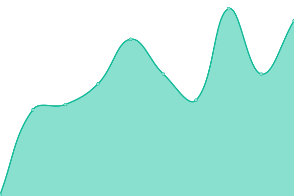
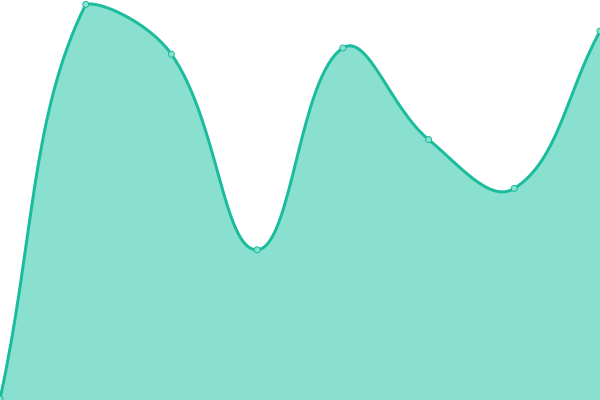
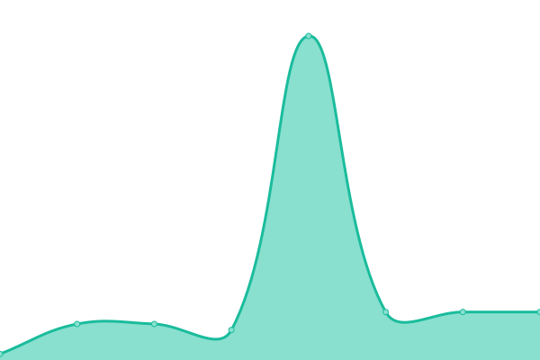

# [📈 Live Status](https://DagsHub.github.io/uptime): <!--live status--> **🟧 Partial outage**

This repository contains the open-source uptime monitor and status page for [DagsHub](https://DagsHub.com), powered by [Upptime](https://github.com/upptime/upptime).

With [Upptime](https://upptime.js.org), you can get your own unlimited and free uptime monitor and status page, powered entirely by a GitHub repository. We use [Issues](https://github.com/DagsHub/uptime/issues) as incident reports, [Actions](https://github.com/DagsHub/uptime/actions) as uptime monitors, and [Pages](https://DagsHub.github.io/uptime) for the status page.

<!--start: status pages-->
<!-- This summary is generated by Upptime (https://github.com/upptime/upptime) -->
<!-- Do not edit this manually, your changes will be overwritten -->
<!-- prettier-ignore -->
| URL | Status | History | Response Time | Uptime |
| --- | ------ | ------- | ------------- | ------ |
|  [DagsHub](https://dagshub.com/) | 🟥 Down | [dags-hub.yml](https://github.com/DagsHub/uptime/commits/HEAD/history/dags-hub.yml) | 

 2545ms
     
 | 

<a href="https://DagsHub.github.io/uptime/history/dags-hub">99.14%</a>
    

|  [Blog](https://dagshub.com/blog/) | 🟥 Down | [blog.yml](https://github.com/DagsHub/uptime/commits/HEAD/history/blog.yml) | 

 313ms
     
 | 

<a href="https://DagsHub.github.io/uptime/history/blog">99.61%</a>
    

|  [Docs](https://dagshub.com/docs/) | 🟩 Up | [docs.yml](https://github.com/DagsHub/uptime/commits/HEAD/history/docs.yml) | 

 22ms
     
 | 

<a href="https://DagsHub.github.io/uptime/history/docs">100.00%</a>
    

<!--end: status pages-->

[**Visit our status website →**](https://DagsHub.github.io/uptime)

## 📄 License

- Powered by: [Upptime](https://github.com/upptime/upptime)
- Code: [MIT](./LICENSE) © [DagsHub](https://DagsHub.com)
- Data in the `./history` directory: [Open Database License](https://opendatacommons.org/licenses/odbl/1-0/)
